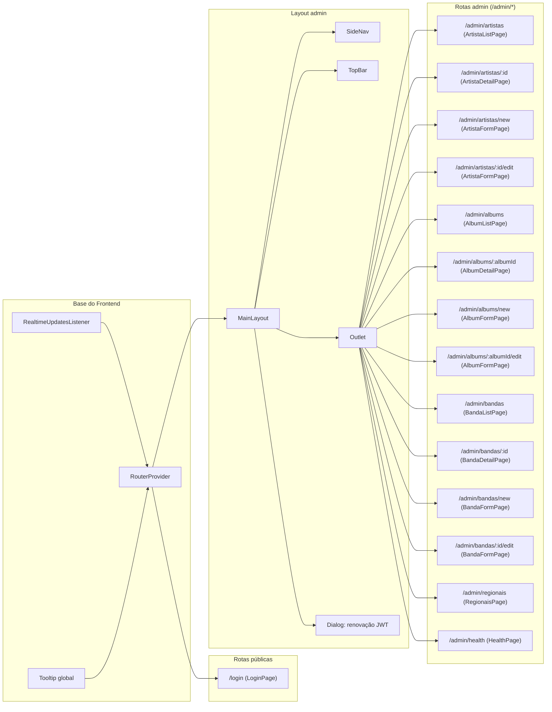
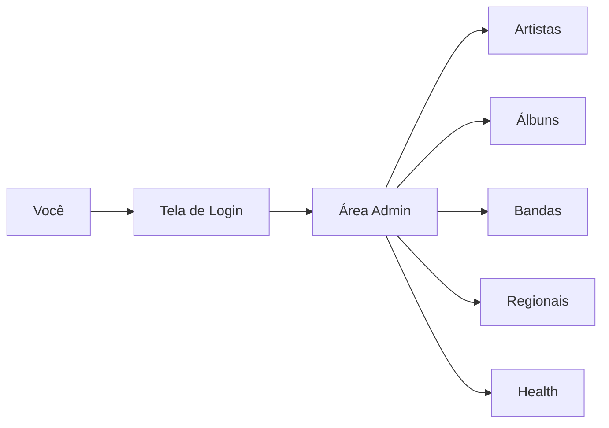

# Projeto Artist Album (SEPLAG/MT 2026)

Projeto prático para o processo seletivo da SEPLAG/MT 2026, com backend em Spring Boot e frontend em React.

## Dados de inscrição

Nome completo: **LUCAS HENRIQUE TASCA DE ARAUJO** 
E-mail: **tascalucas6@gmail.com** 
Inscrição: **16425** 
Vaga: **Full Stack** 

## Commits gerados por Lucas Henrique Tasca de Araujo - Taskera123 

## Visão geral

- **Backend**: API REST com autenticação JWT, banco PostgreSQL, storage MinIO, WebSocket e documentação OpenAPI.
- **Frontend**: SPA em React (Vite) + tailwind com framework reactprime para área pública e administrativa.

## Arquitetura modular

O backend é organizado por **domínios** (artista, álbum, banda, regional, auth), cada um contendo camadas de **controller**, **service**, **repository**, **dto** e **model**. Essa separação favorece:

- **Manutenibilidade**: mudanças em um domínio não impactam os demais.
- **Escalabilidade**: facilita adicionar novas funcionalidades sem acoplamento.
- **Testabilidade**: serviços e repositórios podem ser testados isoladamente.
- **Clareza**: fluxo de dados explícito entre entrada (DTO) → regra de negócio (Service) → persistência (Repository).

No frontend, a organização é por **páginas**, **componentes** e **serviços**, mantendo o consumo de APIs centralizado e facilitando a evolução da UI.

## Modelo de dados (PostgreSQL)

As migrações Flyway definem o esquema inicial. Principais tabelas e relações:

### Tabelas principais

- **artista**: armazena o cadastro de artistas.
- **album**: armazena os álbuns e referencia um artista (`album.idArtista`).
- **albumCapa**: armazena capas dos álbuns, com indicação de capa principal e chave do objeto no MinIO.
- **banda**: cadastro de bandas.
- **bandaArtista**: tabela de relacionamento N:N entre banda e artista.
- **regional**: cadastro de regionais (sincronizadas com API externa).

### Relações

- **Artista 1:N Álbum**: um artista possui vários álbuns.
- **Álbum 1:N AlbumCapa**: um álbum pode ter múltiplas capas (com uma principal).
- **Banda N:N Artista**: uma banda pode ter vários artistas e vice‑versa (via `bandaArtista`).

## Stack principal

**Backend**
- Java + Spring Boot 3.2
- Spring Data JPA + PostgreSQL
- Spring Security + JWT
- Flyway (migrations)
- MinIO (armazenamento de capas)
- WebSocket (STOMP)

**Frontend**
- React 19 + Vite
- PrimeReact/PrimeFlex + Tailwind
- Axios + RxJS

## Como clonar o repositorio

```bash
git clone https://github.com/Taskera123/lucashenriquetascadearaujo043103.git
```

## Como adentrar o ambiente
> Após ter feito o clone do projeto, tem que adentrar a pasta do projeto:

```bash
cd lucashenriquetascadearaujo043103
```

## Como executar (Docker Compose)

> Este projeto utiliza **Docker** para levantar a aplicação completa (backend, frontend, banco e MinIO).

1. **(Recomendado)** No powershell limpe o cache/volumes do Docker antes de subir, para evitar conflitos de banco/porta:

```bash
docker rmi -f ${docker ps -aq)
docker system prune -a --volumes -f
```

2. Suba os serviços:
> na raiz /lucashenriquetascadearaujo043103

```bash
docker compose up --build
```

3. Acesse:

- **Frontend**: http://localhost:8081
- **Backend**: http://localhost:8080/albumartistaapi
- **Swagger UI**: http://localhost:8080/albumartistaapi/swagger-ui/index.html
- **Health check**: http://localhost:8080/albumartistaapi/actuator/health
- **MinIO Console**: http://localhost:9001

## Credenciais

### Frontend (login administrativo)

- **Usuário**: `admin`
- **Senha**: `admin123`

## Estrutura de pastas

### Backend (Spring Boot)

```
backend/
├── src/
│   ├── main/
│   │   ├── java/com/seplag/artistalbum/
│   │   │   ├── config/                # Configurações (security, ratelimit, websocket)
│   │   │   ├── domain/
│   │   │   │   ├── album/              # Domínio de álbuns (controller, dto, mapper, model, repository, service)
│   │   │   │   ├── artista/            # Domínio de artistas
│   │   │   │   ├── auth/               # Autenticação e autorização
│   │   │   │   ├── banda/              # Domínio de bandas
│   │   │   │   └── regional/           # Domínio de regionais
│   │   │   ├── shared/
│   │   │   │   ├── controller/         # Endpoints comuns (root, catálogo)
│   │   │   │   ├── dto/                # DTOs compartilhados
│   │   │   │   ├── exception/          # Tratamento global de erros
│   │   │   │   ├── service/            # Serviços utilitários
│   │   │   │   └── websocket/          # Recursos compartilhados do WebSocket
│   │   │   └── ArtistaAlbumApplication.java
│   │   └── resources/
│   │       ├── db.migration/           # Scripts Flyway
│   │       ├── application.properties
│   │       └── application-docker.properties
│   └── test/
│       └── java
│         └── artistalbum
|                ├── config
|                │   └── ratelimit
│                └── domain
│                    ├── album
│                    │   └── service
│                    ├── artista
│                    │   ├── controller
│                    │   └── service
│                    ├── auth
│                    │   └── controller  
│                    └── banda
│                        └── service
└── pom.xml
```

### Frontend (React + Vite)

```
frontend/
├── public/                             # Assets estáticos
├── src/
│   ├── assets/                          # Imagens e ícones
│   ├── components/                      # Componentes reutilizáveis
│   │   ├── albums/                      # Componentes de álbuns
│   │   ├── artistas/                    # Componentes de artistas
│   │   ├── bandas/                      # Componentes de bandas
│   │   └── layout/                      # Layout (MainLayout, SideNav, TopBar)
│   ├── facades/                         # Facades para comunicação com APIs
│   ├── pages/                           # Páginas principais
│   ├── routes/                          # Rotas e controle de acesso
│   ├── services/                        # Serviços (HTTP, auth, etc.)
│   ├── state/                           # Estado global / stores
│   ├── tests/                           # Testes
│   ├── types/                           # Tipagens e interfaces
│   ├── utils/                           # Utilitários
│   ├── App.tsx
│   └── main.tsx
└── package.json
```

### Banco de dados (PostgreSQL)

- **Host**: `localhost`
- **Porta**: `5432`
- **Database**: `artist_album_db`
- **Usuário**: `artist_user`
- **Senha**: `artist_pass`

### MinIO

- **Endpoint**: http://localhost:9000
- **Access Key**: `admin123`
- **Secret Key**: `admin123`
- **Bucket**: `artist-album-covers`

### JWT

- **Secret**: `31031994lucashenriquetascadearaujo04310316140`
- **Expiração**: `300000` (ms)

## Endpoints da API

> Base URL: `http://localhost:8080/albumartistaapi`

### Autenticação
- `POST /auth/login` — autentica o usuário e retorna JWT/refresh.
- `POST /auth/refresh` — renova o token JWT com refresh token válido.

### Root
- `GET /`

### Artistas
- `POST /v1/artistas` — cria um artista.
- `GET /v1/artistas` — lista artistas (padrão).
- `GET /v1/artistas/{idArtista}` — detalha artista por ID.
- `PUT /v1/artistas/{idArtista}` — atualiza artista por ID.
- `DELETE /v1/artistas/{idArtista}` — remove artista por ID.
- `GET /v1/artistas/paginado` — lista paginada de artistas.
- `GET /v1/artistas/pesquisa` — pesquisa artistas por filtros.
- `GET /v1/artistas/all` — lista completa (sem paginação).
- `PUT /v1/artistas/{idArtista}/foto` (multipart) — atualiza foto do artista.
- `GET /v1/artistas/{idArtista}/foto` — obtém foto do artista.

### Álbuns
- `POST /v1/albums` — cria um álbum.
- `GET /v1/albums/{idAlbum}` — detalha álbum por ID.
- `PUT /v1/albums/{idAlbum}` — atualiza álbum por ID.
- `DELETE /v1/albums/{idAlbum}` — remove álbum por ID.
- `POST /v1/albums/{id}/capa` (multipart) — envia capa principal do álbum.
- `POST /v1/albums/{id}/capas` (multipart) — envia múltiplas capas.
- `PUT /v1/albums/{id}/capa` (multipart) — substitui capa principal.
- `GET /v1/albums/capa/{idAlbum}` — obtém capa principal.
- `GET /v1/albums/{id}/capas/{idCapa}/arquivo` — obtém arquivo de capa específica.
- `GET /v1/albums/{id}/capas` — lista capas do álbum.
- `PUT /v1/albums/{id}/capas/{idCapa}/principal` — define capa principal.
- `GET /v1/albums/artista/{idArtista}` — lista álbuns por artista (paginado).
- `GET /v1/albums/all` — lista todos os álbuns.
- `GET /v1/albums/artista/{idArtista}/todos` — lista todos os álbuns de um artista.
- `GET /v1/albums/{id}/capa/url` — obtém URL assinado da capa.

### Bandas
- `POST /v1/bandas` — cria uma banda.
- `GET /v1/bandas` — lista bandas (padrão).
- `GET /v1/bandas/{idBanda}` — detalha banda por ID.
- `PUT /v1/bandas/{idBanda}` — atualiza banda por ID.
- `DELETE /v1/bandas/{idBanda}` — remove banda por ID.
- `GET /v1/bandas/paginado` — lista paginada de bandas.
- `POST /v1/bandas/{idBanda}/artistas` — associa artistas à banda.
- `DELETE /v1/bandas/{idBanda}/artistas/{idArtista}` — remove artista da banda.
- `GET /v1/bandas/{idBanda}/artistas` — lista artistas da banda.

### Regionais
- `GET /v1/regionals` — lista regionais cadastradas.
- `POST /v1/regionals/sync` — sincroniza regionais com API externa.
- `POST /v1/regionals` — cria regional manualmente.
- `PUT /v1/regionals/{id}` — atualiza regional por ID.

### Catálogo
- `GET /v1/catalogo` — retorna catálogo consolidado (artistas, álbuns, bandas).

### WebSocket (STOMP)
- **Handshake**: `/ws`
- **Enviar**: `/app/ping`
- **Receber**: `/topic/artist-updates`

# Fluxograma de uso do projeto

```mermaid
flowchart TD
    A[Início] --> B[Clonar repositório]
    B --> C[Preparar ambiente Docker]
    C --> D[docker compose up --build]

    D --> E[Serviços ativos]
    E --> F[Frontend (React) :8081]
    E --> G[Backend (Spring Boot) :8080/albumartistaapi]
    E --> H[PostgreSQL :5432]
    E --> I[MinIO :9000 / Console :9001]

    F --> J[Login administrativo]
    J --> K[Autenticação JWT]
    K --> G

    G --> L[APIs de Artistas/Álbuns/Bandas/Regionais]
    L --> M[Persistência no PostgreSQL]
    L --> N[Upload/Download de capas no MinIO]

    G --> O[Catálogo público]
    O --> F

    G --> P[WebSocket STOMP]
    P --> Q[Atualizações em tempo real no frontend]

    M --> R[Consultas e relatórios]
    N --> R
    Q --> R

    R --> S[Fim]
```

## Fluxo detalhado do frontend 



## Componentes por página (detalhado)

### Página pública

- **/login (LoginPage)**: Card, InputText, Button, Message; valida usuário/senha e chama `AuthFacade.login()`.

### Layout admin (compartilhado)

- **MainLayout**: SideNav + TopBar + Outlet; Dialog para renovação de token JWT e logout automático.

### Artistas

- **/admin/artistas (ArtistaListPage)**: Carousel de álbuns, DataTable de artistas, filtros (InputText + Dropdown), botões de ações.
  - Componentes internos: `ArtistFormDialog`, `ArtistDetailDialog`.
- **/admin/artistas/:id (ArtistaDetailPage)**: Card de álbuns do artista, imagem/foto do artista, botões de navegação.
  - Componentes internos: `ArtistFormDialog`, `AlbumFormDialog`, `AlbumCoverUploader`.
- **/admin/artistas/new** e **/admin/artistas/:id/edit (ArtistaFormPage)**:
  - Componente interno: `ArtistFormDialog` (modo create/edit).

### Álbuns

- **/admin/albums (AlbumListPage)**: grid de cards de álbuns, filtros por artista/banda, paginação local.
  - Componente interno: `AlbumFormDialog` (criar/editar).
- **/admin/albums/:albumId (AlbumDetailPage)**:
  - Componente interno: `AlbumDetailDialog`.
- **/admin/albums/new** e **/admin/albums/:albumId/edit (AlbumFormPage)**:
  - Componente interno: `AlbumFormDialog` (modo create/edit).

### Bandas

- **/admin/bandas (BandaListPage)**: DataTable com ordenação e paginação.
  - Componentes internos: `BandFormDialog`, `BandDetailDialog`.
- **/admin/bandas/:id (BandaDetailPage)**:
  - Componente interno: `BandDetailDialog`.
- **/admin/bandas/new** e **/admin/bandas/:id/edit (BandaFormPage)**:
  - Componente interno: `BandFormDialog` (modo create/edit).

### Regionais

- **/admin/regionais (RegionaisPage)**: DataTable, Dialog de edição, inputs para criação e sincronização com API externa.

### Saúde

- **/admin/health (HealthPage)**: Card + Message para mostrar status do backend e botão de re-teste.

## Pontos de acesso

- **Frontend**: http://localhost:8081
- **Backend**: http://localhost:8080/albumartistaapi
- **Swagger UI**: http://localhost:8080/albumartistaapi/swagger-ui/index.html
- **MinIO Console**: http://localhost:9001

## Guia didático simples

### 1) O que é este sistema?

Imagine uma biblioteca de músicas. Aqui você cadastra **artistas**, **álbuns** e **bandas**. Também pode **enviar capas** dos álbuns (imagens) e **ver atualizações em tempo real** quando algo muda.

### 2) Como entrar (passo a passo simples)

1. Abra o navegador.
2. Vá para o endereço do frontend: **http://localhost:8081**.
3. Você verá a tela de **Login**.
4. Digite usuário e senha e clique em **Entrar**.
5. Pronto! Você entra na área administrativa.

### 3) Desenho leve do caminho (imagem simples)



### 4) O que cada botão faz (bem explicado)

#### Tela de Login

- **Entrar**: tenta fazer login com o usuário e senha.
- **Olho (mostrar senha)**: mostra ou esconde a senha digitada.

#### Layout Admin (menu lateral e topo)

- **Menu lateral (SideNav)**: é o “mapa” para ir às páginas (Artistas, Álbuns, Bandas, Regionais, Health).
- **Topo (TopBar)**: mostra seu usuário.
- **Dialog de sessão**: aparece quando o login está para expirar.
  - **Renovar token**: continua logado por mais tempo.
  - **Sair**: faz logout.

#### Página Artistas (/admin/artistas)

- **Pesquisar artista**: digite o nome e pressione Enter para buscar.
- **Ordenar (A → Z / Z → A)**: muda a ordem da lista.
- **Novo artista**: abre o formulário para cadastrar.
- **Ações na lista**:
  - **Ver detalhes**: abre a página do artista.
  - **Editar**: abre o formulário para alterar.

#### Página Detalhe do Artista (/admin/artistas/:id)

- **Voltar**: retorna para a lista de artistas.
- **Gerenciar álbuns**: leva à lista de álbuns do artista.
- **Novo álbum**: abre criação de álbum já ligado ao artista.
- **Editar**: abre o formulário do artista.
- **Trocar capa** (em cada álbum): abre upload da imagem do álbum.

#### Página Álbuns (/admin/albums)

- **Filtro por artista**: mostra apenas álbuns de um artista.
- **Filtro por banda**: mostra álbuns ligados aos artistas da banda.
- **Novo álbum**: abre formulário de criação.
- **Ações nos cards**:
  - **Olho**: abre detalhes do álbum.
  - **Lápis**: abre edição do álbum.

#### Página Detalhe do Álbum (/admin/albums/:albumId)

- **Fechar/voltar**: sai do detalhe e volta para a lista.

#### Página Bandas (/admin/bandas)

- **Ordenar**: troca a ordem da lista.
- **Nova banda**: cria uma banda.
- **Ações na lista**:
  - **Ver detalhes**: abre detalhes da banda.
  - **Editar**: abre o formulário da banda.

#### Página Regionais (/admin/regionais)

- **Atualizar lista**: recarrega as regionais do servidor.
- **Sincronizar base**: busca regionais da API externa.
- **Criar regional**: salva uma nova regional.
- **Editar regional**: abre janela para alterar nome/ativo.
- **Ativo**: liga/desliga se a regional está ativa.

#### Página Health (/admin/health)

- **Re-testar**: faz novo teste de saúde do backend.

### 5) Dicas para não se perder

- **Se algo não aparece**, clique em **Atualizar lista** ou recarregue a página.
- **Se der erro de login**, verifique usuário e senha.
- **Se a sessão expirar**, clique em **Renovar token**.